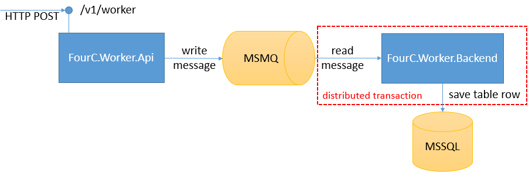

# CI Practice

### Assessment criteria
- Completeness of implementation according to the requirements.
- Simplicity and readabilty of code.
- Maintainability of the solution.

### Application

The assignment simulates system with following workflow.

1. External actor (User) sends a REST request to the `FourC.Worker.Api` endpoint at `/v1/worker`
1. `FourC.Worker.Api` handles web request by posting it to the queue (MSMQ)
1. A backend process `FourC.Worker.Backend` reads messages from the queue and processes the message by creating record in the database. The above action is done in the context of a distributed transaction that requires MSDTC.



### Create one or more powershell scripts that perform the following actions:

#### Phase 1 - Build Environment Setup
1. Install Git for Windows
1. Install .NET Core SDK
1. Install Microsoft .NET Framework 4.6.1 Developer Pack

#### Phase 2 - Build
1. Clone the https://github.com/mruzic/CIEndava.git repository into some folder
1. Restore .NET Core Package
1. Build / Publish (Release Mode)
  1. FourC.Worker.Api
  1. FourC.Worker.Backend
1. Create ZIP archive with published artifacts (3.i, 3.ii)

#### Phase 3 - Execution Environment Setup
1. Install MSDTC
1. Install MSMQ
1. Install IIS
1. Install ASP.NET Core
1. Install SQL Server 2014/2016 (Express)

#### Phase 4 - Deployment
1. Extract ZIP archive (From Phase 2 Step 4)
1. Run SQL script that will create the database and table structures. (Located inside the Scripts folder on repository)
1. Configure and host the REST endpoint (Web Application) on IIS
1. Configure and start (in background) the backend application

### Test

To test if the application is working properly you can use Postman and perform a test request to the REST API:

```
POST http://localhost/v1/worker

Content-Type: application/json

Body:

{
   "user":"Test",
   "content":"Test",
   "timestamp":"2016-12-16T02:00:00Z"
}
```

Connect to the SQL Server instance you created and perform a select on Work table, if this table has contents the application is successfully deployed.

### Assume

* Suggestion is to install/use the Windows Server into a new VM Machine that you need to create using the evaluation version of Windows and can be directly downloaded at Microsoft website.
* The REST endpoint (Web Application/API) should be configured to run on "localhost" on port 80.
* You need to do some research and come up with a PowerShell script that connects to SQL Server and runs the SQL Script we provided to setup the database table structure.

### Notes

* Given a clean Windows 2012R2/2016 Server machine, this powershell script should run and install/deploy all those components without errors.
* You can also suggest improvements to the build pipeline or point to security issues.
* You can "Fork" this repository on Github and commit your solution into the some folder, ex: "Solution".
